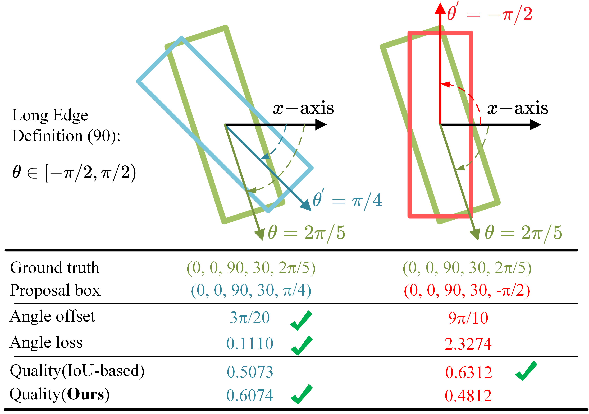
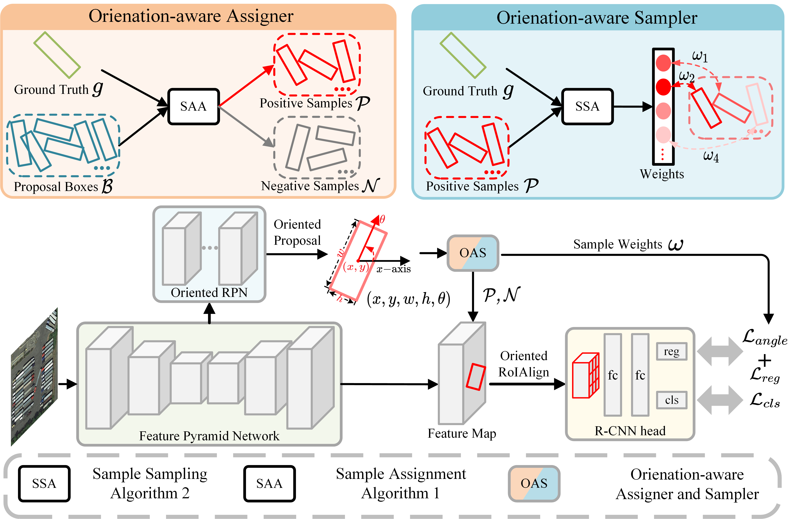

# Rethinking Label Assignment and Sampling Strategies for Two-Stage Oriented Object Detection
note: We mainly disclose the code based on RPGAOD here. (i.e. RPGAOD+OAS)
# Introduction
This article proposes a new direction aware allocator and sampler (OAS) to alleviate the problem of angle periodicity by improving label allocation and sampling strategies. It combines angle and position information to optimize the allocation of positive and negative samples, and adjusts learning weights based on angle differences, thereby significantly improving the performance of the two-stage rotating object detector. The experimental results indicate that OAS can achieve higher detection accuracy on multiple challenging rotating target detection benchmarks without increasing additional costs.

# Motivation
<div align="center">

</div>

# Overall method
<div align="center">

</div>

# Get Started
(1) Prepare environment
```
# create environment
conda create -n RPGAOD_oas python=3.7 pip --yes
conda activate RPGAOD_oas

# download and install pytorch and torchvision
wget https://download.pytorch.org/whl/cu113/torch-1.10.0%2Bcu113-cp37-cp37m-linux_x86_64.whl#sha256=2a90db92579ed875d2aa0ad6af55359e3f0426a523056a7b49b002c3cc6d2ad8
wget https://download.pytorch.org/whl/cu113/torchaudio-0.10.0%2Bcu113-cp37-cp37m-linux_x86_64.whl#sha256=16ca574d33837643b49cf5097099bcfaf2c8bdc9146bc8117c13c14fd2dc28fc
wget https://download.pytorch.org/whl/cu113/torchvision-0.11.0%2Bcu113-cp37-cp37m-linux_x86_64.whl#sha256=d0cbfedc7ee6ede94d1f60531fc178691e9cf1cddedcb5d7168fd0dc8249e46e
pip install torch-1.10.0+cu113-cp37-cp37m-linux_x86_64.whl
pip install torchaudio-0.10.0+cu113-cp37-cp37m-linux_x86_64.whl
pip install torchvision-0.11.0+cu113-cp37-cp37m-linux_x86_64.whl

# clone this codebase, including submodule
git clone https://github.com/skyandkibo/OAS.git --recursive
cd RPGAOD

# install submodule
cd BboxToolkit
pip install -v -e .
cd ..

cd mmdet
cd ops
cd orn
pip install -v -e .
cd ../../..

# install mmcv
pip install mmcv-full==1.3.17 -f https://download.openmmlab.com/mmcv/dist/cu113/torch1.10.0/index.html

# install other requirements
pip install mmpycocotools
pip install timm==0.8.0dev0
pip install yapf==0.40.0

# install this codebase
pip install -v -e .
```

(2) Prepare data

Download the DOTA dataset from [official website](https://captain-whu.github.io/DOTA/dataset.html), change the diretory in and , and then run the following script `./BboxToolkit/tools/split_configs/dota1_0/ss_trainval.json` `./BboxToolkit/tools/split_configs/dota1_0/ss_test.json`
cd ./BboxToolkit/tools/
python img_split.py --base_json split_configs/dota1_0/ss_trainval.json
python img_split.py --base_json split_configs/dota1_0/ss_test.json

# Usage
# Training
```
Single GPU
python tools/train.py configs/obb/RPGAOD/SR2_ORCNN_r50_dota10_oas.py

Multi-GPU
./tools/dist_train.py configs/obb/RPGAOD/SR2_ORCNN_r50_dota10_oas.py 4 29500
```
# Testing
```
python tools/test.py configs/obb/RPGAOD/SR2_ORCNN_r50_dota10_oas.py work_dirs/SR2_ORCNN_r50_dota10_oas/epoch_36.pth --format-only --options save_dir=保存文件夹名字
```

We provide the pretrained models as listed below. (Trained on 4 RTX 3090 GPUs, tested on 1 RTX 3090 GPU)
| Detector | Dataset | box AP (in paper)| box AP (this repo) | pretrained model & config |
| --- | --- | --- | --- | --- |
| RPGAOD | DOTA | 76.47 | 76.50 | [BaiduCloud](https://pan.baidu.com/s/1w3EvJPdZAlEQwUluHQFp7Q?pwd=hx7q)
| RPGAOD+OAS | DOTA | 77.90 | 78.11 | [BaiduCloud](https://pan.baidu.com/s/1cCEWGVHW-KelY14GeIPwiw?pwd=aa36)
| RPGAOD | DIOR-R | 63.87 | 63.85 | [BaiduCloud](https://pan.baidu.com/s/1ctQS4rjB4T3H28AHGPTN5g?pwd=4sgf)
| RPGAOD+OAS | DIOR-R | 64.41 | 64.57 | [BaiduCloud](https://pan.baidu.com/s/1SGgNWkCUdLPEn4B9zy4yGQ?pwd=3gbm)

# Acknowledgement
This code is developed on the top of [RPGAOD](https://github.com/QYJ123/RPGAOD), we thank to their efficient and neat codebase.

# Citation
If you find our work is useful in your research, please consider citing:
```
@article{qian2025rethinking,
  title={Rethinking Label Assignment and Sampling Strategies for Two-Stage Oriented Object Detection},
  author={Qian, Jinjin and Liu, Chengxu and Ai, Yubin and Zhao, Guoshuai and Qian, Xueming},
  journal={IEEE Geoscience and Remote Sensing Letters},
  year={2025},
  publisher={IEEE}
}
```


